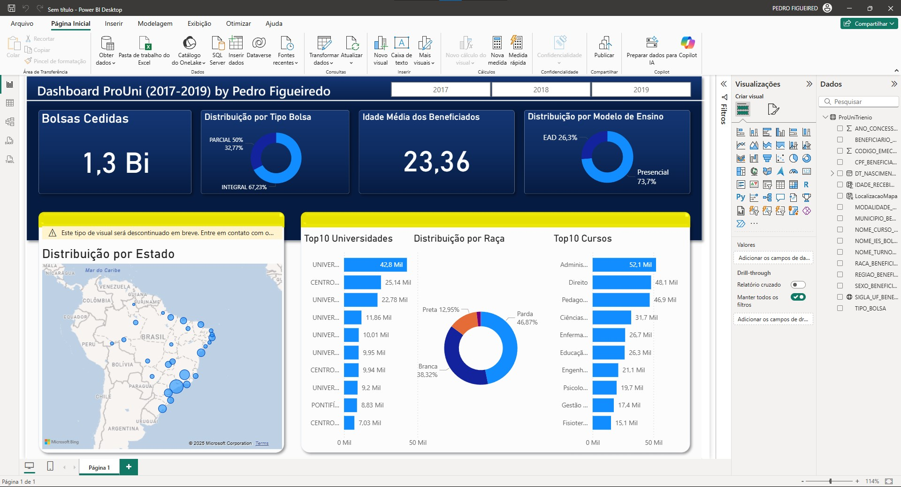

# 🚀 Arquitetura 1: Análise Desktop (Power BI)

Esta abordagem foca na velocidade de prototipação e na análise local, sendo a mais acessível para a maioria dos usuários.

## 1. Processo de ETL (Extração, Transformação e Carga)

Os dados não foram simplesmente "jogados" no Power BI. Foi necessário um pré-processamento para unificar e tratar os dados:

* **Extração:** Os 3 *datasets* anuais (2017-2019) foram baixados do Portal de Dados Abertos do Governo.
* **Transformação:** Foi utilizado um script **Python** (`scripts/unificar_dados.py`) com a biblioteca **Pandas** para:
    1. Ler os 3 arquivos CSV separados (que estavam na pasta `/dados`).
    2. Concatená-los (empilhar) em um único DataFrame.
    3. Salvar o resultado como um único arquivo (`dados/ProUniTrienio.csv`) para ser usado como fonte de dados.
* **Carga:** O arquivo `ProUniTrienio.csv` foi carregado no Power BI.

## 2. Modelagem e Análise no Power BI

Dentro do Power BI, foi realizada a modelagem para criar os *insights* do dashboard:

* **Criação de Features (DAX):** A coluna `Idade Na Concessao` foi criada do zero usando **DAX**, subtraindo o ano de concessão do ano de nascimento (`ProUniTrienio[ANO_CONCESSAO_BOLSA] - YEAR(ProUniTrienio[DT_NASCIMENTO_BENEFICIARIO])`). Isso permitiu a análise de "Média de Idade" (KPI).
* **Limpeza (DAX):** A coluna `LocalizacaoMapa` foi criada com DAX (`'ProUniTrienio'[SIGLA_UF_BENEFICIARIO_BOLSA] & ", Brasil"`) para corrigir ambiguidades do motor de mapas (ex: "MT" = Mato Grosso, não Montana/EUA).

## 3. Montagem e Justificativa dos Gráficos (O Tutorial)

Cada visual foi escolhido para responder uma pergunta específica. Abaixo está o "porquê" e o "como fazer" de cada um.

### KPI 1 e 2: Cartões (Resumo Rápido)

* **Pergunta:** Qual o número total de bolsas e a média de idade dos beneficiários?
* **Por quê:** Cartões são usados para destacar os números mais importantes (KPIs) do painel.
* **Como Fazer:**
    1. Adicione dois visuais de **"Cartão"**.
    2. **Cartão 1:** Arraste `CPF_BENEFICIARIO_BOLSA` para o campo "Valores" e mude a agregação para **"Contagem (Distinta)"**.
    3. **Cartão 2:** Arraste a coluna `Idade Na Concessao` (criada com DAX) para o campo "Valores" e mude a agregação para **"Média"**.

### Filtro 1: Segmentação de Dados (O Filtro de Ano)

* **Pergunta:** Como posso ver os dados de um ano específico?
* **Por quê:** A segmentação permite ao usuário filtrar todo o painel, tornando o dashboard interativo.
* **Como Fazer:**
    1. Adicione um visual de **"Segmentação de Dados"**.
    2. Arraste `ANO_CONCESSAO_BOLSA` para o campo "Campo".
    3. Na formatação do visual, mude o estilo para **"Bloco"** para criar os botões.

### Gráfico 1: Mapa (Distribuição Geográfica)

* **Pergunta:** Onde as bolsas estão concentradas no Brasil?
* **Por quê:** Um mapa é a forma mais intuitiva de mostrar dados geográficos.
* **Como Fazer:**
    1. Adicione um visual de **"Mapa"**.
    2. Arraste a coluna `LocalizacaoMapa` (criada com DAX) para o campo **"Localização"**.
    3. Arraste `CPF_BENEFICIARIO_BOLSA` para o campo **"Tamanho da Bolha"**.
    4. Mude a agregação do `CPF` para **"Contagem (Distinta)"**.

### Gráfico 2 e 3: Gráfico de Barras (Top 10 Cursos e Universidades)

* **Pergunta:** Quais os 10 principais cursos e universidades?
* **Por quê:** Gráficos de barras horizontais são os melhores para "rankings" (Top 10), pois os nomes longos (cursos, IES) ficam fáceis de ler.
* **Como Fazer (Repita para `NOME_CURSO_BOLSA` e `NOME_IES_BOLSA`):**
    1. Adicione um visual de **"Gráfico de barras empilhadas"**.
    2. Arraste `NOME_CURSO_BOLSA` para o **"Eixo Y"**.
    3. Arraste `CPF_BENEFICIARIO_BOLSA` para o **"Eixo X"** (e mude para **"Contagem (Distinta)"**).
    4. No painel **"Filtros"**, expanda o filtro `NOME_CURSO_BOLSA`, mude o "Tipo de Filtro" para **"N superior"**, digite **10** em "Itens", e arraste `CPF_BENEFICIARIO_BOLSA` (Contagem Distinta) para o campo **"Por valor"**.

### Gráfico 4, 5 e 6: Gráfico de Rosca (Proporções)

* **Pergunta:** Qual a proporção de bolsas por Raça, Tipo e Modelo de Ensino?
* **Por quê:** Gráficos de rosca (ou pizza) são perfeitos para mostrar a composição percentual (partes de um todo) de forma simples.
* **Como Fazer (Repita para `RACA_BENEFICIARIO_BOLSA`, `TIPO_BOLSA`, `MODALIDADE_ENSINO_BOLSA`):**
    1. Adicione um visual de **"Gráfico de Rosca"**.
    2. Arraste `RACA_BENEFICIARIO_BOLSA` para a **"Legenda"**.
    3. Arraste `CPF_BENEFICIARIO_BOLSA` para os **"Valores"** (e mude para **"Contagem (Distinta)"**).

## 4. Resultado (Dashboard)

(O arquivo .pbix interativo está na pasta /power_bi_local)

# ☁️ Arquitetura 2: Pipeline de Nuvem (AWS)

Esta abordagem foca em uma solução escalável, automatizável e padrão de mercado, capaz de lidar com volumes de dados massivos — exatamente como o nosso arquivo de 108 MB.

O tutorial a seguir demonstra como criar um pipeline de dados "Serverless" (sem servidor) usando os serviços da AWS.

## 1. Ingestão de Dados (AWS S3)

O primeiro passo é mover nossos dados locais para a nuvem. Usamos o **AWS S3 (Simple Storage Service)**, um serviço de armazenamento de objetos.

* **Ação:** Um script Python (`scripts/upload_para_s3.py`) usando a biblioteca `boto3` foi criado para automatizar o processo.
* **O que ele faz:**
    1.  Verifica se o bucket (ex: `pdroozi-prouni-projeto-extensao`) existe.
    2.  Se não existir, ele o **cria automaticamente** na região especificada (ex: `us-east-1`).
    3.  Faz o upload do arquivo `dados/ProUniTrienio.csv` para dentro do bucket.

### 2. O Processo (A Prova)

Abaixo está o passo a passo documentado do processo de ingestão:

**Passo 1: O Console da AWS**
O primeiro contato com o console da AWS, onde os serviços são gerenciados.

**Passo 2: O S3 Vazio**
O serviço S3 antes da execução do nosso script, ainda sem "buckets" (locais de armazenamento).

**Passo 3: A Execução do Script**
O log do terminal do VS Code, mostrando o script `upload_para_s3.py` sendo executado e confirmando a criação do bucket e o início do upload.

**Passo 4: O Bucket Criado**
Após o script, o bucket `bucket_pdroozi_projeto_prouni` agora existe no S3.

**Passo 5: O Arquivo CSV Uploadado**
A prova final: nosso arquivo `ProUniTrienio.csv` (108.7 MB) está agora armazenado de forma segura na nuvem, dentro do bucket.

---

## 2. Catálogo de Dados (AWS Glue)

Com o arquivo no S3, precisamos de um método *Serverless* para ler e entender a estrutura do CSV de 108 MB. Usamos o **AWS Glue** para criar um Catálogo de Dados (metadados) sobre o arquivo, sem precisar carregar ele em um banco de dados tradicional.

* **Ação:** Criamos um **Glue Crawler** (Rastreador), que é uma ferramenta automatizada de descoberta de esquema.
* **O que ele faz:**
    1.  O Crawler "lê" o arquivo `ProUniTrienio.csv` diretamente do S3.
    2.  Ele analisa os dados para **detectar automaticamente o esquema** (nomes das colunas e tipos de dados).
    3.  Ele salva esse esquema como uma nova "tabela" em um "Banco de dados Glue".

### O Processo (Tutorial Passo a Passo)

| Ação | Descrição | Imagem |
| :--- | :--- | :--- |
| **Console Glue** | Primeiro acesso ao serviço AWS Glue. |  |
| **Criar Crawler** | Início da configuração do novo Crawler. |  |
| **Propriedades** | Definição do nome do Crawler (ex: `prouni-csv-crawler`). |  |
| **Fonte de Dados** | Apontando o Crawler para o caminho exato do bucket S3 (`s3://.../dados/`). |  |
| **IAM Role** | Criação do IAM Role com permissões de leitura no S3, essencial para o sucesso da execução. |  |
| **Database/DB** | Definição de onde a tabela de esquema será salva (ex: no `prouni_db`). |  |
| **Crawler Criado** | O Crawler pronto para a execução. |  |
| **Execução** | Início manual da execução do Crawler. |  |
| **Conclusão** | O Crawler finaliza a varredura do arquivo e gera o esquema. |  |
| **Tabela Final** | **Prova:** A tabela `prouni_dados` (ou similar) é criada no Catálogo de Dados, contendo o esquema de colunas do nosso CSV. |  |

---

## 3. Transformação e Consulta (AWS Athena)

Com a tabela catalogada, usamos o **AWS Athena** para rodar consultas SQL diretamente sobre os arquivos no S3. Este serviço atua como nossa camada de **Transformação (T)** no pipeline de nuvem, replicando as colunas calculadas do Power BI.

* **Ação:** Criamos consultas SQL para gerar novas "features" (colunas calculadas) em tempo real, sem alterar o arquivo original no S3.
* **Ferramenta:** Usamos o Editor de Consultas do Athena (interface web).

### O Processo (A Prova)

| Ação | Descrição | Imagem |
| :--- | :--- | :--- |
| **Painel Athena** | Primeiro contato com a interface do Athena, com a tabela do Glue já disponível. |  |
| **Transformação 1: Idade** | Criação da coluna `idade_na_concessao` usando as funções `CAST` e `SUBSTR` do SQL para replicar a lógica do DAX. |  |
| **Transformação 2: Localização** | Criação da coluna `localizacao_mapa` usando a função SQL `CONCAT` para resolver o problema de geocodificação do mapa. |  |
| **Consulta Final** | A consulta SQL que une as duas transformações e seleciona os dados prontos para o QuickSight. Esta é a nossa *fonte de dados final* na arquitetura AWS. |  |

---
## 4. Visualização Final (AWS QuickSight)

O último passo do pipeline de nuvem é a visualização dos dados transformados.

* **Ação:** O **AWS QuickSight** foi utilizado para conectar-se à consulta SQL final no Athena.
* **Conexão:** O QuickSight usa a camada de Athena para ler os dados, garantindo que o dashboard seja sempre atualizado e escalável.

### O Processo de Conexão e Análise (Tutorial Passo a Passo)

| Ação | Descrição | Imagem |
| :--- | :--- | :--- |
| **Painel QuickSight** | Acessando o console para iniciar a análise. |  |
| **Página Inicial** | A página inicial do QuickSight, onde as análises são criadas. |  |
| **Criar Análise** | Início do processo para criar uma nova visualização. |  |
| **Fonte de Dados** | Escolha da fonte de dados **Athena**, que consulta nosso Catálogo Glue. |  |
| **Catálogo/Tabela** | Seleção do `prouni_db` (nosso Catálogo Glue). |  |
| **SQL Personalizado** | Colagem da consulta SQL final do Athena, criando as colunas calculadas (Idade e Localização Lógica). |  |
| **Confirmação** | Confirmação da conexão e entrada na tela de Preparação de Dados (Data Prep). |  |
| **Página de Análise** | A interface de Business Intelligence (BI) para montagem do dashboard. |  |
| **Resultado Final** | O dashboard QuickSight com os visuais de KPI, Proporção e Ranking replicados. |  |

---
## Conclusão e Valor do Projeto

Este projeto demonstrou que, embora o **Power BI** seja superior em velocidade e facilidade de prototipação, a arquitetura **AWS** (S3 > Glue > Athena > QuickSight) é a solução ideal para grandes volumes de dados e para a criação de um pipeline de dados *serverless* e profissional, alinhando o aprendizado técnico com o requisito de extensão da UNIP através deste tutorial comparativo.
